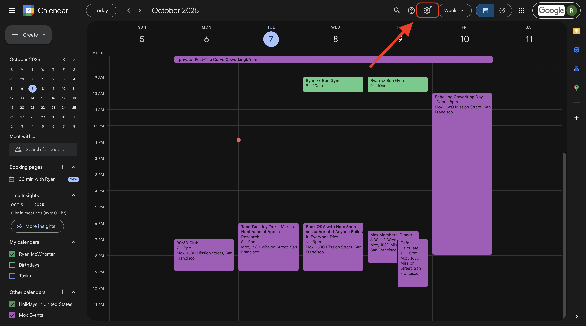
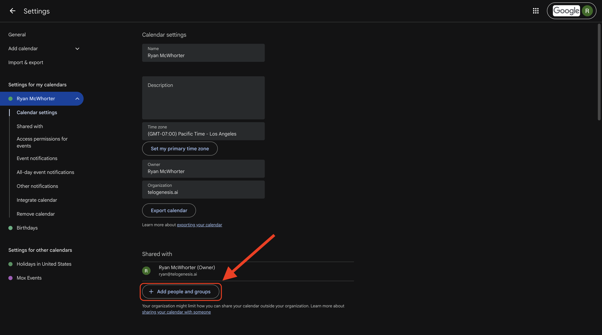
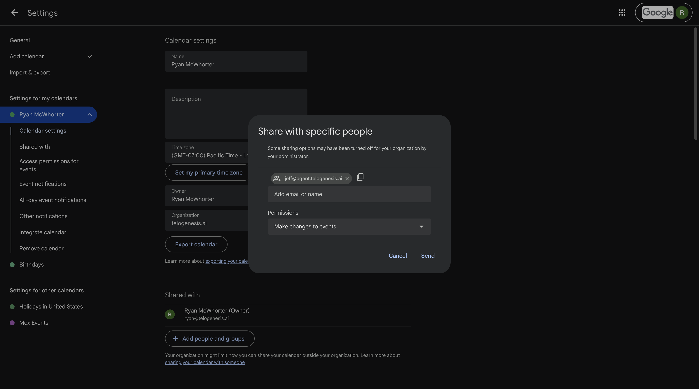
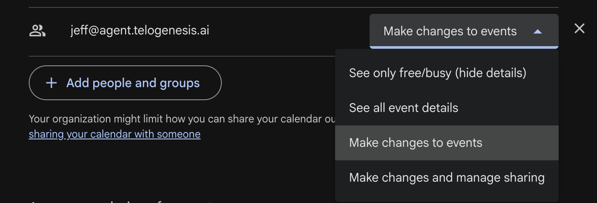

# Sharing

Every Telogenesis employee has an email address (for example, `jeff@agent.telogenesis.ai`). You can share your Google calendars with your employees through the [Google Calendar](https://calendar.google.com) web app, just like you would with a human employee. You can browse shared calendars in the [Calendars](https://dashboard.telogenesis.ai/calendar) section in the dashboard.

## Share the calendar in Google Calendar

1. Visit https://calendar.google.com, go to Settings, and pick the calendar that you want to share.
   

2. Click on **Add people and groups**.
   
   
3. Share your calendar with your employee, using whatever permissions level you think is appropriate.
   

4. Click **Send** to send the sharing invitation to your employee.

You can revoke calendar access for your employees at any time through the [Google Calendar](https://calendar.google.com) web app.

# Permissions

Google providers four permission levels for calendar sharing. We support all of them. They are:
 - See only free/busy (hide details)
 - See all event details
 - Make changes to events
 - Make changes and manage sharing

We recommend picking **Make changes to events**, as that will let your employees create new events for you, in addition to checking your availability. If you have privacy concerns and don't want your employee to see event specifics, you should pick **See only free/busy (hide details)**.

# Prerequisites

- The employee must have the `google_calendar` tool category enabled (check the **Tool Categories** section, in the [Employee Tab](https://dashboard.telogenesis.ai/employees)).