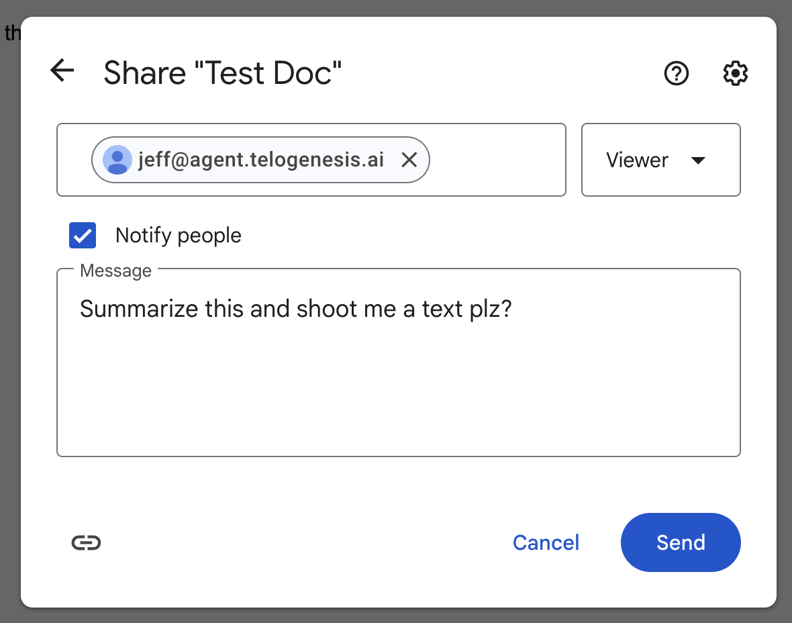

# Sharing

Every Kuren employee has an email address (for example, `jeff@agent.kuren.ai`). You can share your Google Drive files and folders with your employees through the [Google Drive](https://drive.google.com) web app, just like you would with a human employee. You can browse shared files and folders in the [Google Drive](https://app.kuren.ai/google-drive) section in the dashboard.

## Share files or folders in Google Drive

1. Visit https://drive.google.com (or docs.google.com, etc) and find the file or folder you want to share.

2. Click **Share** (or right-click and select **Share**).
   

3. Share your file or folder with your employee, using whatever permissions level you think is appropriate.
   

4. Click **Send** to send the sharing invitation to your employee.

You can revoke Drive access for your employees at any time through the [Google Drive](https://drive.google.com) web app.

# Permissions

Google provides three permission levels for Drive sharing. We support all of them. They are:
 - Viewer (read-only access)
 - Commenter (can add comments and suggestions)
 - Editor (can make changes)

We recommend picking **Editor**, as that will let your employees create and edit documents, spreadsheets, and other files for you. If you don't want your employee to modify certain files, you should pick **Viewer** or **Commenter**. You can revoke permission at any time.

# Prerequisites

- The employee must have the `google_docs` tool category enabled (check the **Tool Categories** section, in the [Employee Tab](https://app.kuren.ai/employees)).
